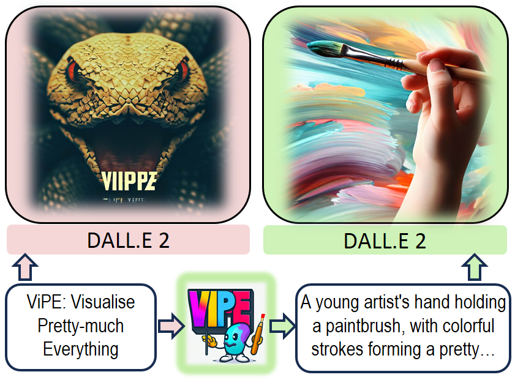

<div>
<div align='center'>
<h2 align="center"> ViPE: Visualise Pretty-much Everything </h2>
<h3 align="center"></h3>
</div>
<div>
<div align="center">
    <a href='https://fittar.me/' target='_blank'>Hassan Shahmohammadi<sup>&#x2709</sup></a>&emsp;
    <a href='https://adhirajghosh.github.io/' target='_blank'>Adhiraj Ghosh</a>&emsp;
    <a href='https://uni-tuebingen.de/fakultaeten/mathematisch-naturwissenschaftliche-fakultaet/fachbereiche/informatik/lehrstuehle/computergrafik/lehrstuhl/mitarbeiter/prof-dr-ing-hendrik-lensch/' target='_blank'>Hendrik PA Lensch</a>&emsp;
    </br>
</div>
<div align="center">
    <a href='https://uni-tuebingen.de/fakultaeten/mathematisch-naturwissenschaftliche-fakultaet/fachbereiche/informatik/lehrstuehle/computergrafik/lehrstuhl/'> Computer Graphics Group, University of Tübingen </a>&emsp;
 

<div style="text-align:center">

</div>

### [ViPE Paper](https://arxiv.org/abs/2310.10543) | [ViPE Videos]()  | [LyricCanvas Dataset]() | [Use in Huggingface](https://huggingface.co/fittar/ViPE-M-CTX7) | [Prompt Generation Demo](https://huggingface.co/spaces/fittar/ViPE)

<!--- <a href="https://pytorch.org/get-started/locally/"></a> -->

</div>

# Project Under Construction

**Note:** This repository is currently under construction and not yet completed. It is a work in progress, and changes are being made regularly. 

Please feel free to check back later for updates or follow/watch this repository to receive notifications when it's ready for use.

Thank you for your patience!


TODO: 
1. Correct all the links. 
2. Add Video generation website 
3. Add HuggingFace page if available
4. Refactor chatgpt, chatgpt_run and genius to one folder called lyric_canvas?
5. Remove .sh files
 -----------------
## 🗄 Code Structure

```
├── vipe
│   ├── chatgpt-run                   <- build your own LLM-powered dataset
│   ├── datasets                      <- path to all relevant datasets to reproduce ViPE results
│   ├── genius                        <- implement the genius API
│   │── README.md                    
│   └── output                        <- folder that stores models and logs
│
```

## 💾 Downloads
TODO:
1. Path to the retrieval files. All 4 pickle files and the images for train and eval. Upload to cloud.

### HAIVMet
We stack ViPE against human annotators in understanding and visualising figurative speech. To that end, we refer to [VisualMetaphors](https://github.com/tuhinjubcse/VisualMetaphors). To download the dataset, please follow their instructions.    

The ```datasets``` folder should have the following structure
```
├── datasets
│   ├── HAIVMet
│   │   │── ad_slogans.zip   
│   │   │── bizzoni.zip
│   │   │── copoet.zip
│   │   │── figqa.zip
│   │   │── flute.zip
│   │   │── tsevtkov.zip
│   ├── retrieval
│   │   │── chatgpt  
│   │   │── haivmet   
│   │   │── vipe   
│   │   │── metaphor_id.pickle   
│   │   │── prompt_dict_chatgpt.pickle  
│   │   │── prompt_dict_haivmet.pickle  
│   │   │── prompt_dict_vipe.pickle  
```

## Evaluation
### Image-Text Retrieval
To generate datasets for the respective models, run the following:
```bash
python3 evaluation/retrieval/create_dataset.py --model <haivmet/vipe/chatgpt> \
--dataset <ad_slogans/bizzoni/copoet/figqa/flute/tsvetkov>\
--savedir <path/to/store/datasets/>\
--img_size <image resolution> --num_images <number of images per prompt>\
--checkpoint <path/to/vipe/checkpoint/if/using/vipe>
```
We conduct vigorous image-text retrieval using the [BLIP model](https://github.com/salesforce/BLIP) as the benchmark model. 
```bash
python3 evaluation/retrieval/evaluation.py --dataset <haivmet/vipe/chatgpt> --output_dir <path/to/store/checkpoints> --id_type <metaphor/prompt>
```
## 📹 Music Video Generation
Music Video Generation strategy as used in our paper. For an updated version, please refer to [ViPE-Videos](https://github.com/Hazel1994/ViPE-Videos).
```bash
python3 ./t2v/create_video.py --img_size 100 --outdir ./results/vids/finalise/ --fps 2
```

## 📑 Citation

If you found this repository useful, please consider citing:
```
@inproceedings{shahmohammadi2023vipe,
    title = "ViPE: Visualise Pretty-much Everything",
    author = "Hassan Shahmohammadi and Adhiraj Ghosh and Hendrik P. A. Lensch",
    booktitle = "Proceedings of the 2023 Conference on Empirical Methods in Natural Language Processing",
    month = dec,
    year = "2023",
    address = "Singapore",
    publisher = "Association for Computational Linguistics",
    url = "https://arxiv.org/abs/2310.10543",
    eprint={2310.10543},
    archivePrefix={arXiv},
    primaryClass={cs.CL}
    doi = "",
    pages = ""
}
```

## 👨‍🏫 Acknowledgements
We refer to portions of the implementations of the following for parts of our research: 

- [Text2Video-Zero](https://github.com/Picsart-AI-Research/Text2Video-Zero)
